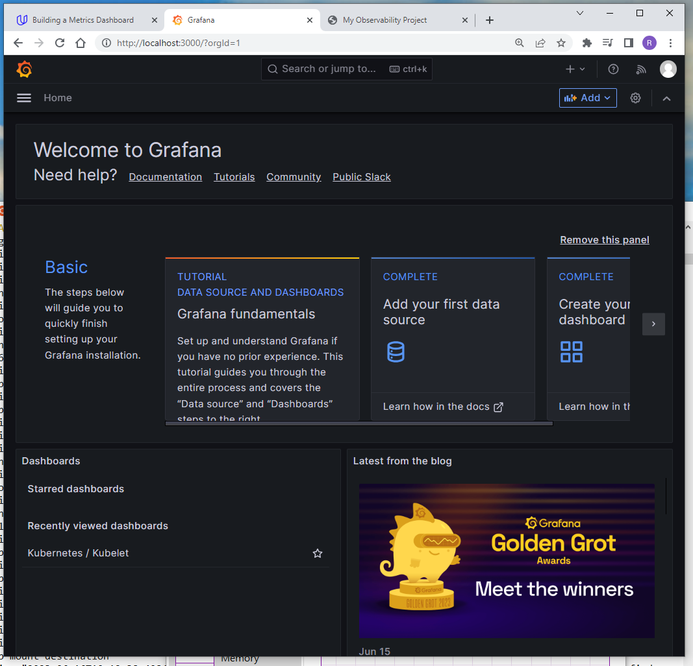

**Note:** For the screenshots, you can store all of your answer images in the `answer-img` directory.

## Verify the monitoring installation

*run `kubectl` command to show the running pods and services for all components. Take a screenshot of the output and include it here to verify the installation*

`kubectl get all -n observability` and `kubectl get all` (Jaeger and example apps):


`kubectl get all -n monitoring` (Prometheus & Grafana):


## Setup the Jaeger and Prometheus source
*Expose Grafana to the internet and then setup Prometheus as a data source. Provide a screenshot of the home page after logging into Grafana.*

Grafana home page:


## Create a Basic Dashboard
*Create a dashboard in Grafana that shows Prometheus as a source. Take a screenshot and include it here.*


## Describe SLO/SLI
*Describe, in your own words, what the SLIs are, based on an SLO of monthly uptime and request response time.*

Service level indicators report the actual performance so that it can be directly compared to SLO.

Examples:
 - *monthly uptime*:
   - typical SLO: "service XYZ will be up for at least 99.9% time in any given month".
   - **corresponding SLI: "service XYZ was up for 99.93% time during June 2023".**
 - *request response time*:
   - typical SLO: "every day, service XYZ will serve 99% of requests within 100ms".
   - **corresponding SLI: "on June 13th 2023, ratio of requests whose response took longer than 100ms was 0.5%".**

## Creating SLI metrics.

*It is important to know why we want to measure certain metrics for our customer. Describe in detail 5 metrics to measure these SLIs.*

 - **daily uptime**: "service XYZ will be up for at least 99.9% time on any given day".
   We will measure time when at least one pod serving service XYZ is running. To "fill in error budget",
   any given time interval when no pod for service XYZ is running will be counted.

   Typically, "service XYZ" would be something the customer faces directly. Main purpose
   of corresponding SLO is to ensure the customer has always accessible interface.

   Measuring internal microservices in this way does not make sense, as they might be down
   intentionally (e. g. a worker instance with empty task queue).

 - **successful requests**: "number of failed requests of service XYZ will be less than 1% on any given day".
   We will count number of successful requests (any request whose response is either 1xx, 2xx or 3xx) and
   number of failed requests (any request whose response is in 4xx and 5xx range).
   Ratio (failed / (successful+failed)) in any given day will be our metrics.

   Main purpose of this metrics is to detect unhandled errors.

   In order to use this metrics, we need to make sure we don't count intentional 4xx and 5xx responses.
   For example, in customer-facing API a 4xx error might just mean the customer has a typo in endpoint URL,
   a 5xx might mean they used invalid input. In both cases, the customer should receive informative error
   message, but this should be received with correct HTTP status code.

   To make this happen, I would recommend selecting "just the right component" where to measure this.
   (Another option is to automatic filter on failed responses based on their content, but that can
   get very complicated and thus should be avoided if simpler option is available.)

   Typically, "service XYZ" would be some backend which is close to customer but likely not directly exposed.

 - **request response time**: "every day, service XYZ will serve 99% of requests within 100ms".
   For service XYZ, we will measure time between we receive request from client until a response is sent back.
   If this interval is less than 100ms, we will count this as timely, if not, it would be a "late response".
   Every day ratio of (late / (timely + late)) needs to be less than 1%.

   Main purpose of this metrics is to ensure application/service responisivity.

   Typically, "service XYZ" would be something directly exposed to the customer. Measuring internal microservices
   does not make sense as they might intentionally take long time to respond.

 - **cpu load ratio**: "every day, average cpu load ratio will be between 25% and 75% on worker-nodes in cluster
   where application XYZ is running".
   
   Main purpose of these metrics is to ensure effective usage of resources, e. g. that horizontal scaling is set up properly.
   If our average cpu load ratio is less than 25%, we are wasting resources (by using more powerfull VMs than we need,
   or by having too many replicas). If the average cpu load ratio is higher than 75%, our infrastructure is likely
   overloaded and might be prone to get laggy.

   Unlike the other metrics, here it makes sense to monitor even "internal microservices". Unlike the previous metrics,
   this one has the potential to detect resource issues before they have impact on real application performance.

 - **memory usage ratio**: "every day, average memory usage will be between 25% and 75% on worker-nodes in cluster
   where application XYZ is running".

   Similar as cpu load ratio. Main purpose is to ensure effective usage or resources, in best case to detect
   resource issues before they have impact on real application performance.
   

## Create a Dashboard to measure our SLIs
*Create a dashboard to measure the uptime of the frontend and backend services. We will also want to measure to measure 40x and 50x errors. Create a dashboard that show these values over a 24 hour period and take a screenshot.*

Exported dashboard code can be found in `grafana/app_dashboard.json`.

  - Uptime is measured using out-of-the-box provided metrics `container_start_time_seconds`, filtered on our app containers.
  
  Following query does the trick:
  ```min(time() - container_start_time_seconds{image=\"docker.io/radimcajzl/udacity-metrics-backend:latest\"})```
  The query inside `min` call returns several time series, coming from the fact we have multiple replicas.
  By using min we are sure to get uptime of the shortest-running instance.

 - In order to get HTTP status codes into Prometheus, I dediced to modify the apps to expose standard Flask metrics
 using [prometheus_flask_exporter package](https://github.com/rycus86/prometheus_flask_exporter).
 This by default exposes `flask_http_request_total` metrics counting number of requests with additional tags, e. g.
 the http status codes. I have added custom tag `app`, which distinguishes frontend and backend.
 
 Queries in the following format are used for the dashboard:
 ```flask_http_request_total{app=\"frontend\", status=~\"5..\"}```

**Screenshot with 24h-dashboard**:  


**Screenshot with 30min-dashboard** (Added for reviewer-convenience as the 24h-dashboard has quite large gap with no data.):  


## Tracing our Flask App
*We will create a Jaeger span to measure the processes on the backend. Once you fill in the span, provide a screenshot of it here. Also provide a (screenshot) sample Python file containing a trace and span code used to perform Jaeger traces on the backend service.*

To add telemetry, we implemented a similar solution as described on [CNCF blog](https://www.cncf.io/blog/2022/04/22/).
Jaeger exports are handled by `opentelemetry.instrumentation.flask.FlaskInstrumentor`, as described in
[OpenTelemetry documentation](https://opentelemetry-python.readthedocs.io/en/latest/exporter/jaeger/jaeger.html).
We use automatic [Flask OpenTelemetry integration](https://opentelemetry-python-contrib.readthedocs.io/en/latest/instrumentation/flask/flask.html) to get automatic traces from Flask endpoints.
Next to that, we define our own span.

**Jaeger span screenshot**:  

**Python code producing the span** (see `reference-app/backend/app.py` and `reference-app/backend/telemetry.py`):  


## Jaeger in Dashboards
*Now that the trace is running, let's add the metric to our current Grafana dashboard. Once this is completed, provide a screenshot of it here.*

To add Jaeger traces to Grafana dashboard, a new data source must be added to grafana at first at Connections -> Your connections.
For Jaeger defined in our `manifests/app/jaeger.yaml` file, the corresponding URL is `http://jaeger-app-query.default.svc.cluster.local:16686`.

We have added all traces labeled with `http.status_code=500` from our backend service, as table. Grafana provides clickable links
in such setup, which allows us to directly see more details for each 500 error from our backends service.


## Report Error
*Using the template below, write a trouble ticket for the developers, to explain the errors that you are seeing (400, 500, latency) and to let them know the file that is causing the issue also include a screenshot of the tracer span to demonstrate how we can user a tracer to locate errors easily.*

TROUBLE TICKET

Name: Radim Cajzl

Date: 2023-06-23

Subject: /star endpoint on app-backend service returns 500 errors due to bad request parsing

Affected Area: One Page Wonder app

Severity: Serious (severely reduces user experience)

Description:
Dear backend developers, since the backend service has been updated, our mobile app users report
the "star" functionality no longer works. Our monitoring shows a large numbers of 500 errors
on our backend service connected to /star endpoint.

Corresponding trace (see below) looks like it fails to parse request body in `reference-app/backend/app.py`.
Is it possible that the expected request format has been changed recently?

May I ask you for a quick fix (e. g. reverting to the previous request format) and for
a long term solution (e. g. to make sure all client-app-teams have implemented the new
request format and proper transition period has been in place)?

Steps to reproduce: run following curl command:
```
curl http://localhost:31081/star -H "Content-Type: application/json" -d '{"id":"test", "distance": 10}'
```

**Trace screenshot**:  


## Creating SLIs and SLOs
*TODO:* We want to create an SLO guaranteeing that our application has a 99.95% uptime per month. Name four SLIs that you would use to measure the success of this SLO.

## Building KPIs for our plan
*TODO*: Now that we have our SLIs and SLOs, create a list of 2-3 KPIs to accurately measure these metrics as well as a description of why those KPIs were chosen. We will make a dashboard for this, but first write them down here.

## Final Dashboard
*TODO*: Create a Dashboard containing graphs that capture all the metrics of your KPIs and adequately representing your SLIs and SLOs. Include a screenshot of the dashboard here, and write a text description of what graphs are represented in the dashboard.  
